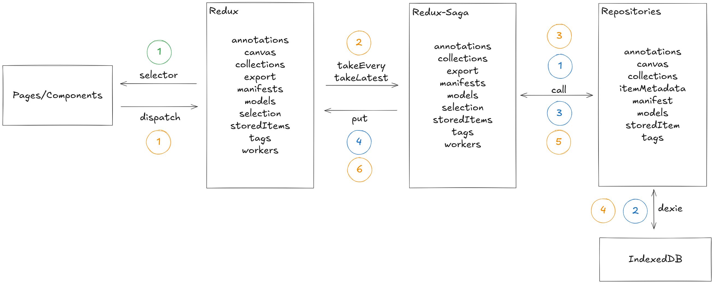

# Corpusense - Architecture

${\color{blue}Chemin \space bleu}$ : chargement initial (au démarrage de l'application)

1. différentes fonction Saga enregistrées (rootSaga) besoin de récupérer les. Elles appellent les repository nécessaire (call)
2. les fonctions dans les repositories récupèrent les données d'IndexedDB grâce à l'orm Dexie
3. les Sagas récupèrent les données des repositories
4. envoie les données vers le store Redux (put)

${\color{green}Chemin \space bleu}$ : un composant a besoin d'afficher une donnée

1. récupération des données provenant du store grâce à un sélecteur (selector)

${\color{orange}Chemin \space orange}$ : mise à jour de données

1. l'utilisateur met à jour une/des donnée(s). Il l'envoie vers le store (dispatch)
2. l'appel vers le store est intercepté par une fonction Saga qui se charge d'appliquer la logique métier. Le store lui ne met pas les données à mettre à jour à jour dans le store. Il peut mettre des variables d'état à jour (type chargement en cours...)
3. la fonction Saga envoie les nouvelles données vers un/des repositories
4. le(s) repositories enregistre(nt) les données dans IndexedDB grâce à Dexie
5. le(s) repositories envoie(nt) les données si nécessaire
6. la fonction Saga envoie l'instruction de mise à jour au store (put)
