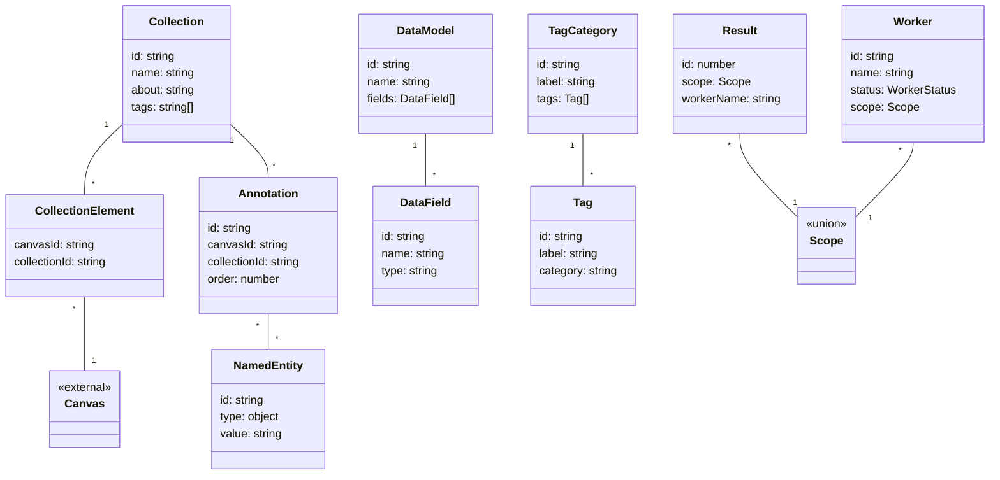

# DATA

```mermaid
classDiagram
    class Collection {
        id: string
        name: string
        about: string
        tags: string[]
    }
    class CollectionElement {
        canvasId: string
        collectionId: string
    }
    class Canvas {
        <<external>>
    }
    class Annotation {
        id: string
        canvasId: string
        collectionId: string
        order: number
    }
    class DataModel {
        id: string
        name: string
        fields: DataField[]
    }
    class DataField {
        id: string
        name: string
        type: string
    }
    class Tag {
        id: string
        label: string
        category: string
    }
    class TagCategory {
        id: string
        label: string
        tags: Tag[]
    }
    class NamedEntity {
        id: string
        type: object
        value: string
    }
    class Result {
        id: number
        scope: Scope
        workerName: string
    }
    class Worker {
        id: string
        name: string
        status: WorkerStatus
        scope: Scope
    }
    class Scope {
        <<union>>
    }

    Collection "1" -- "*" CollectionElement
    CollectionElement "*" -- "1" Canvas
    Collection "1" -- "*" Annotation
    DataModel "1" -- "*" DataField
    TagCategory "1" -- "*" Tag
    Annotation "*" -- "*" NamedEntity
    Result "*" -- "1" Scope
    Worker "*" -- "1" Scope
```
