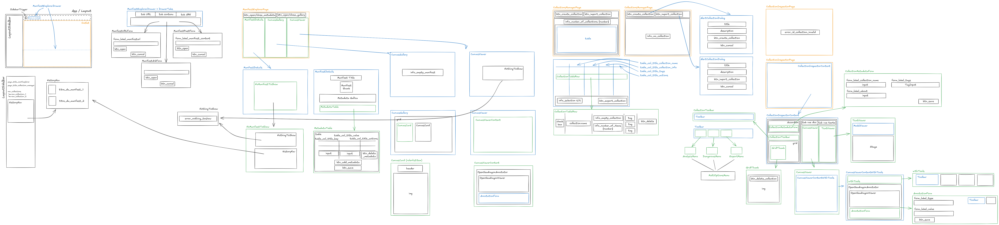

# Corpusense - User Interface

Pour l'instant, l'interface utilisateur se réparti de 3 manières :

1. **pages** : au nombre de 4 actuellement :
   - ManifestExplorerPage : affiche les manifests
   - CollectionsManagerPage : affiche les collections
   - CollectionInspectorPage : affiche une collection
   - ConfigurationPage : page de configuration
2. **components**
3. **ui** : composants shadcnui (<https://ui.shadcn.com/docs/components/>) + shadcnui expansions (<https://shadcnui-expansions.typeart.cc>)

Les icones proviennent de Lucide (<https://lucide.dev/icons/>).
Les icones animées proviennent de React Spinners (<https://www.davidhu.io/react-spinners/>)
