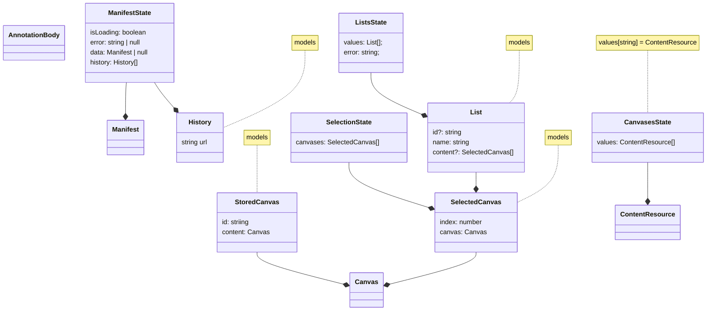

# DATA

```mermaid
classDiagram
    class Canvas {

    }
    class Manifest {

    }
    class AnnotationBody { }
    class History {
        string url
    }
    note for History "models"
    class List {
        id?: string
        name: string
        content?: SelectedCanvas[]
    }
    note for List "models"
    class SelectedCanvas {
        index: number
        canvas: Canvas
    }
    note for SelectedCanvas "models"
    List --* SelectedCanvas
    SelectedCanvas --* Canvas
    class StoredCanvas {
        id: striing
        content: Canvas
    }
    note for StoredCanvas "models"
    StoredCanvas --* Canvas

    class ManifestState {
        isLoading: boolean
        error: string | null
        data: Manifest | null
        history: History[]
    }
    ManifestState --* History
    ManifestState --* Manifest

    class SelectionState {
        canvases: SelectedCanvas[]
    }
    SelectionState --* SelectedCanvas

    class ListsState {
        values: List[];
        error: string;
    }
    ListsState --* List

    class CanvasesState {
        values: ContentResource[]
    }
    CanvasesState --* ContentResource
    note for CanvasesState "values[string] = ContentResource"

    classDef History fill:#f96
```
